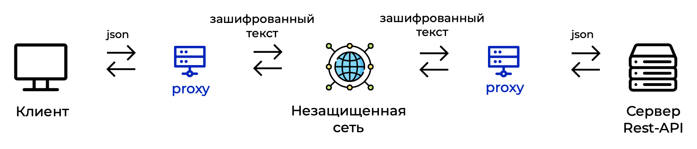

# Прокси для шифрования взаимодействия с Rest-API по ГОСТ 34.12-2018

Идея продукта состоит в том, чтобы добавить универсальный промежуточный сервис, который позволит шифровать данные, передаваемые между клиентом и сервером, по алгоритмам ГОСТ, ничего при этом не меняя в реализации исходных систем.

Прокси представляет собой единое приложение на python3 (FastAPI), конфигурируемое через yaml-файл, которое может работать в двух режимах:

- proxy-client 
- proxy-server

## proxy-client

- получает запрос от клиента, 
- шифрует,
- отправляет на сервер,
- получает с сервера шифрованный ответ,
- расшифровывает его 
- и отдает клиенту

Запуск в режиме proxy-client:

`CONFIG_PATH=client.yaml uvicorn main:app`

## proxy-server

- получает шифрованный запрос от клиента,
- расшифровывает,
- отправляет на сервер,
- получает с сервера ответ, 
- зашифровывает его
- и отдает клиенту

Запуск в режиме proxy-server:

`CONFIG_PATH=server.yaml uvicorn main:app`